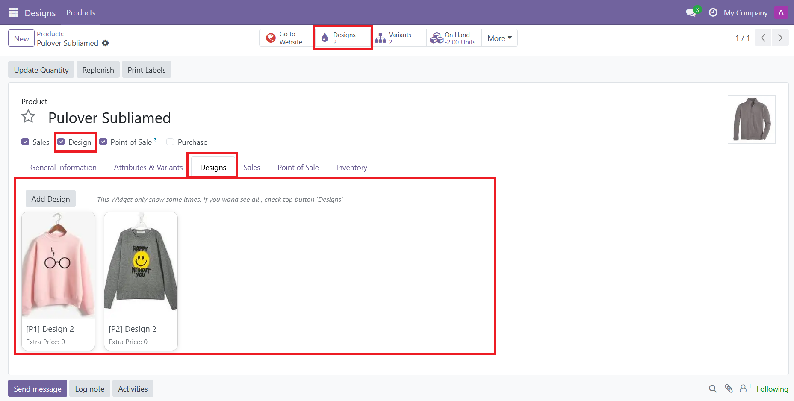
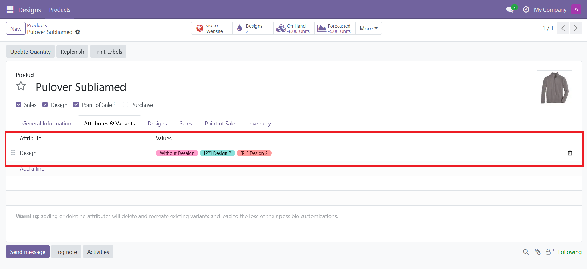
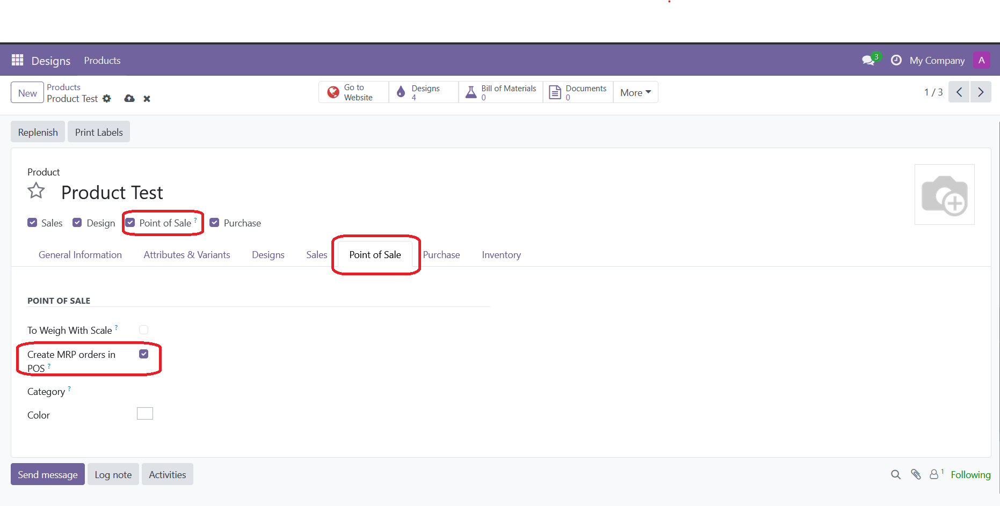

<h1 style="display: flex; align-items: center; gap: 15px;">
    eDesign
    
</h1>
<!--  -->

This repository contains a suite of Odoo modules designed to extend product customization capabilities by introducing a flexible "Design" feature. It integrates this functionality with Manufacturing (MRP), Point of Sale (POS), and the Odoo Website, creating a comprehensive solution for managing and selling customizable products.

## Modules

This repository is organized into the following Odoo modules:

### 1. eDesign (`e_design`)
This is the core module that introduces the concept of product designs. It allows you to associate designs with products, similar to product variants, but without creating actual storable product variants.

**Features:**
*   **Design Management:** Create, categorize, and manage a catalog of designs with unique names, internal references, images, and files.
*   **Non-Variant Attributes:** Adds a "Design" product attribute that functions as a selection without generating new product variants, keeping your product database clean. Add additional attribute value "Without Design"

### 2. POS & MRP Integration (`e_pos_mrp`)
This module links the Point of Sale with the Manufacturing module, automating the creation of manufacturing orders for products sold through POS.

**Features:**
*   **Automated Manufacturing Orders:** When a product with a Bill of Materials (BoM) and the `Create MRP orders in POS` flag is sold via POS, a manufacturing order is automatically generated upon session closing.
*   **Traceability:** Provides a smart button from the POS order to the generated manufacturing orders.

### 3. POS, MRP & Design Integration (`e_pos_mrp_design`)
This module bridges the gap between the design, POS, and manufacturing modules, ensuring design information is carried through the entire process.

**Features:**
*   **Design in Manufacturing:** When a product with a specific design is sold through POS, the selected design is automatically linked and displayed on the resulting manufacturing order.
*   **Visual Reference:** Gives production staff a clear visual and informational reference of the exact design to be manufactured.

### 4. Website Design Catalog (`e_website_design`)
This module exposes the design catalog to the public through the Odoo Website, allowing customers to browse available designs.

**Features:**
*   **Public Catalog:** Adds a `/catalog` endpoint to your website, with dedicated pages for browsing all designs, categories, and associated products.
*   **Dynamic Frontend:** Built with modern OWL components for a responsive and interactive user experience.
*   **Filtering and Searching:** Users can filter designs by product or category and use a live search functionality to quickly find what they are looking for.
*   **Design Detail Page:** Each design has its own page with a gallery of images (using a Fancybox viewer) and detailed information.
