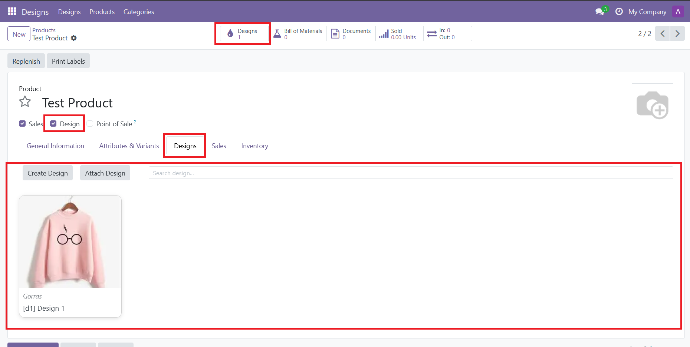
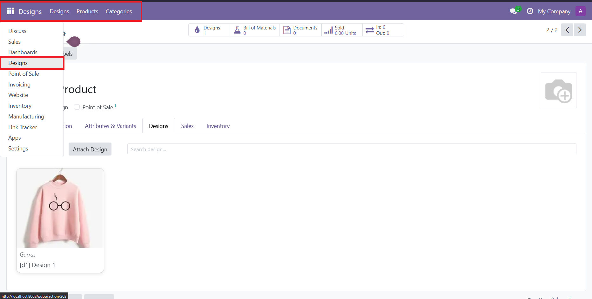

<h1 style="display: flex;gap: 15px;">
    
    eDesign
</h1>

This module enables you to create and link design to products

**Product Template**

**Own Module**

### Features

- **Design Categories**: Organize designs into customizable categories for better management
- **Basic Design Data**: Each design includes essential information (name, code)
- **Image Catalog**: Upload multiple images for each design
- **Format Specification**: Attach a specific file referencing the design's saved format (includes images)
