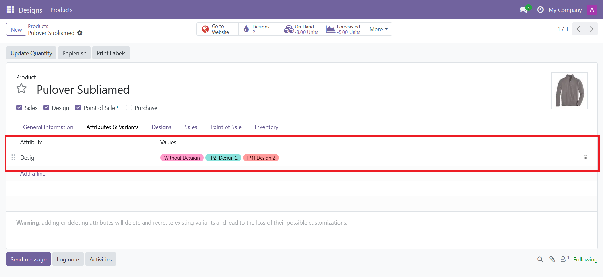

<h1 style="display: flex;gap: 15px;">
    
    eDesign
</h1>

This module enables you to create design variants without generating traditional style variants. These designs can be linked from:

**From the product itself (page' notbook or smart button):**

**Or directly from the module:**

These designs are selectable from Sales, POS, and other Odoo modules as they function as native Odoo variants.

### Features

- **Design Categories**: Organize designs into customizable categories for better management
- **Basic Design Data**: Each design includes essential information (name, code)
- **Image Catalog**: Upload multiple images for each design
- **Format Specification**: Attach a specific file referencing the design's saved format (includes images)
