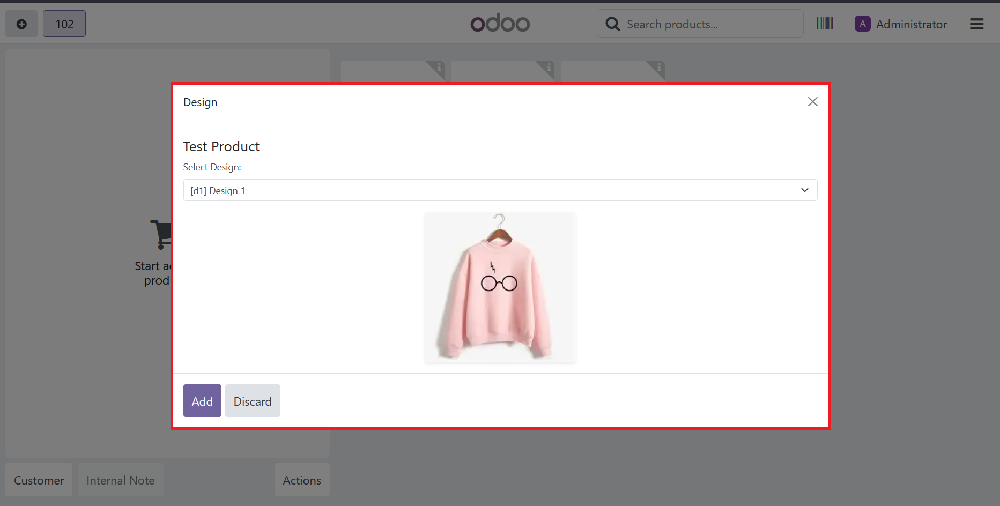

# ePosMrpDesign
#### POS, MRP & Design Integration
This module ensures design information flows automatically from POS sales to manufacturing orders, giving production teams visual references.

**Design displayed on Manufacturing Order**

Selected designs appear directly on manufacturing orders, providing clear visual guidance for production staff.

Features
- Design Propagation: Automatically transfers selected product designs from POS orders to manufacturing orders
- Visual Manufacturing Reference: Displays design images and specifications directly on production orders
- Complete Traceability: Maintains design context throughout the entire sales-to-production chain