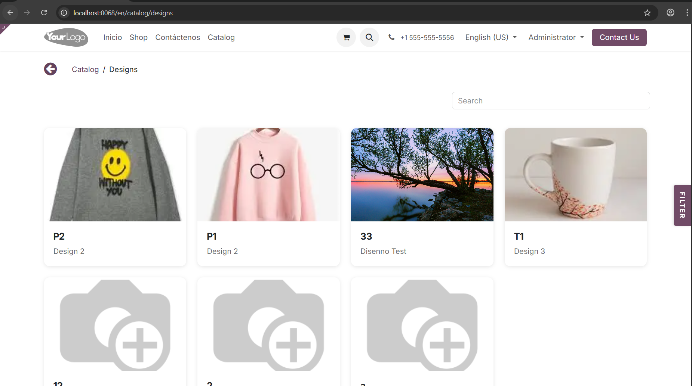

# eWebsiteDesign
#### Website Design Catalog 
This module publishes your design catalog to the public website, enabling customers to browse and search available designs.
----------------
**Public catalog interface:**
----------------

----------------
**Design detail page with image gallery**
----------------

----------------
The catalog includes live search, category filtering, and an interactive image gallery for each design.
Features
- Public Catalog: Adds a /catalog endpoint with dedicated pages for browsing designs, categories, and associated products
- Dynamic Frontend: Built with modern OWL components for responsive, interactive user experience
- Advanced Filtering: Users can filter by product or category and use live search functionality
- Design Detail Pages: Each design has its own page with image gallery (Fancybox viewer) and detailed information

----------------

----------------