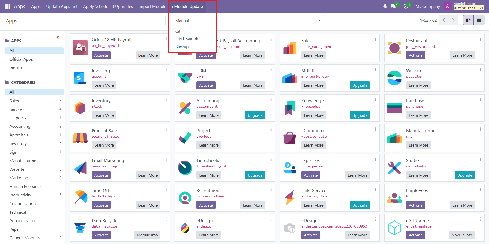
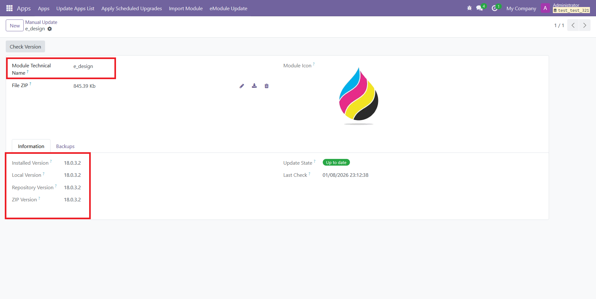
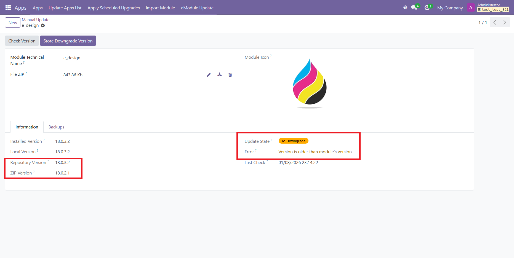
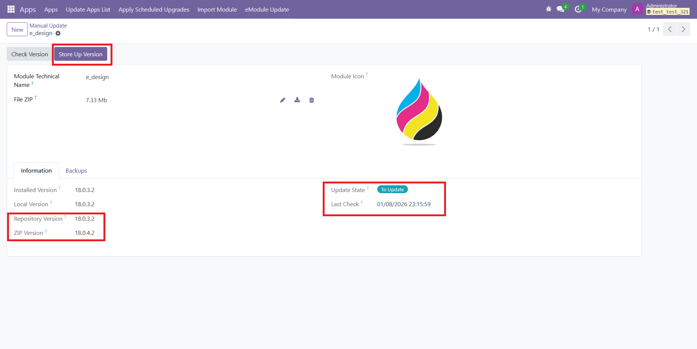
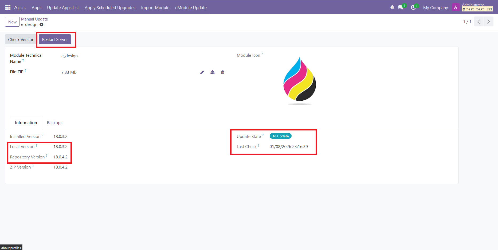
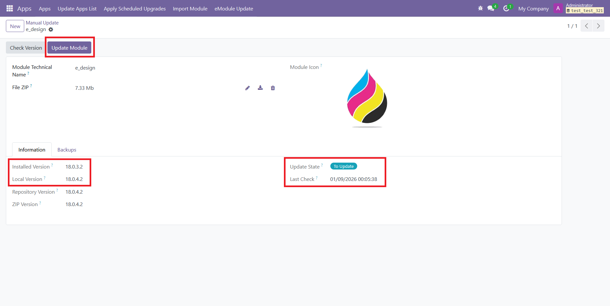

# eModuleUpdate

This module lets you import a module into Odoo via manual ZIP or GitHub.

**Important: Not recommended for production environments; the module downloads and imports third-party code – verify the sites and modules to import; ensuring their safety is the user's responsibility.**

***Required: write permissions on the addons directory that contains this module and on the directories of the modules you plan to update (needed to edit modules and handle backups).***

### Basic Flow:
- Access the module from Apps → eModuleUpdate
- The menu gives access to update modes and backups
    
- Every record has a required field 'module_name' (the installed module to update). Four version values are shown:
    - Installed (in DB)
    - Local (in Odoo cache)
    - Repository (in the file-system)
    - Remote (per eUpdate type; e.g. git_version or zip_version)

    
- You can install newer or older versions; versions older than the current one are flagged with a warning for easy identification
    

### Action Buttons:
- **Store / Download** ***[Remote → Local]***: shown when remote and local versions differ; downloads the new version to the file-system
    
- **Restart Server** ***[Local → Repository]***: shown when local and repository versions differ; reminds you to restart the server so Odoo's cache refreshes
    - Restarting the service is up to the user; the module only warns that a restart is needed. Restart the Odoo service (or the whole OS) and reload the page for the change to take effect
    
- **Update Version** ***[Installed → Local]***: shown when installed and local versions differ; installs the local copy into the DB
    

### Update Modes
##### Manual:
- Import a zip that contains the whole module
- Module code may sit at the zip root or inside a folder named after the module
- Only .zip files are allowed

##### Git remote:
- Checks the selected module's version in a remote repo (GitHub) and updates from it
- You must supply the URL, sub-folder (required) and branch
- Two download options: 'ZIP' downloads the entire repo and processes only the target folder; 'RAW' uses the GitHub API/raw mode to fetch just the module's files. Both create a zip internally and process it

### Backups
- Every operation creates a backup of the module's current code before replacing it
- Backups are stored inside the 'e_module_update' module directory under '.backups', grouped by module, using the format: **"v{{version}}-{{%y%m%d_%H%M%S}}"**
- You can delete backups or restore a version (restoring does NOT create an extra backup beforehand)
- A server action on the form lets you generate a backup of the current version on demand
- From the eUpdateModule menu in Apps you can browse all backups, grouped by module, and delete or restore them (opens the same manual form for editing)