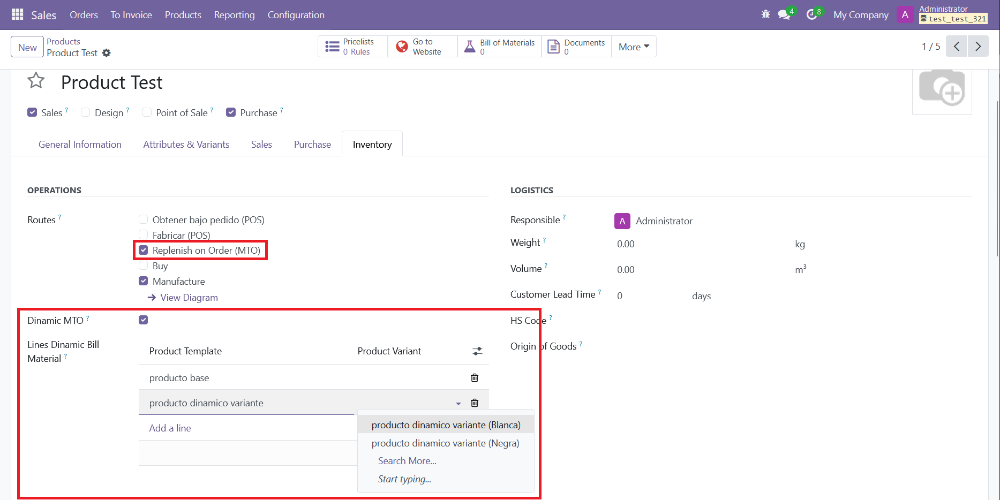
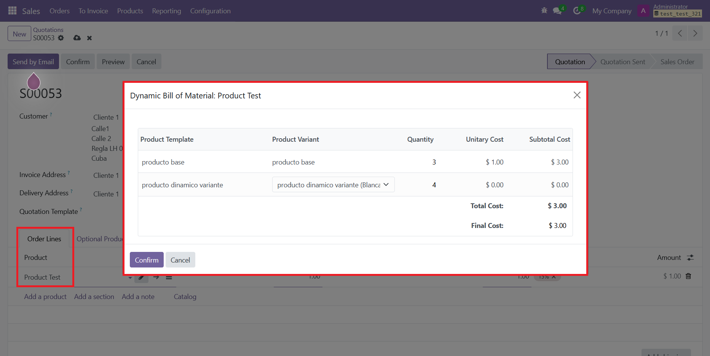
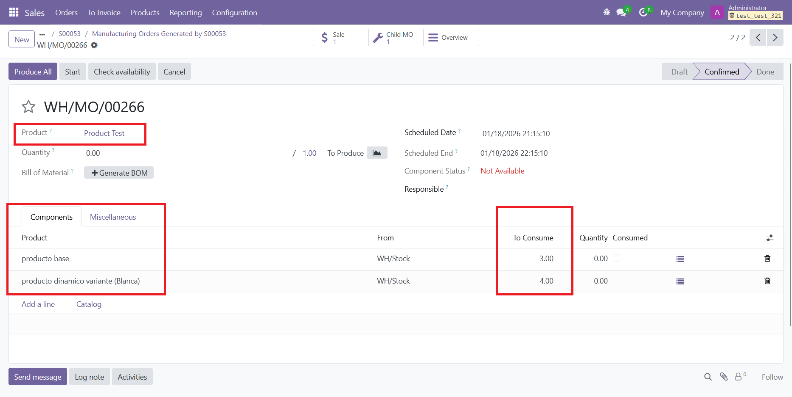

# eProductDynamic  
This module lets you create products that use a dynamic Bill of Materials. The goal is to sell dynamic or customized products based on a static list of components, while still being able to vary quantities and the final price.

### Dynamic Product Assignment  
- Configure the product as “Dynamic MTO” when the 'MTO' Route (Manufacture to Order) is active. You must select a Product Template and Variants. If a Template has variants, it is possible to select a specific variant or leave it blank to select the variant in real time during line configuration.
      

### Sale  
- When a dynamic product is added to the sale, a pop-up opens where the user can choose the variants, quantities from the dynamic BOM, and set the final price.  
      
- Upon confirming the sale, the manufacturing order created does not have a Bill of Materials, but includes the products and quantities selected in the lines.  
     

  