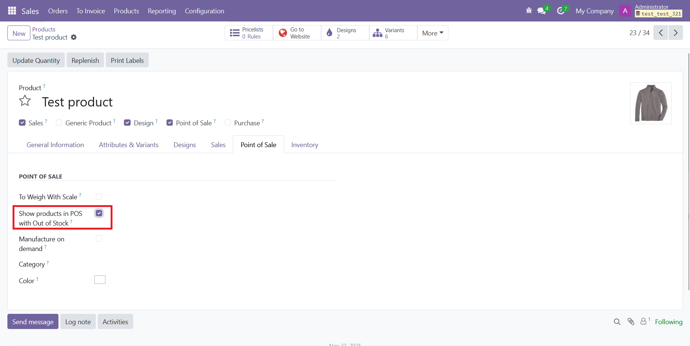
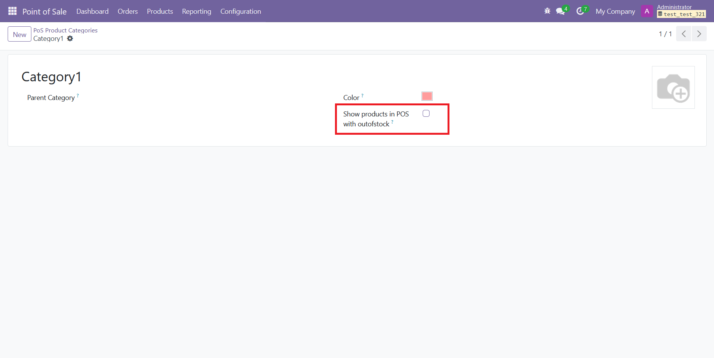

# ePosOutStock

This module hides products that are out of stock in the Point of Sale.

### Configurable  
- Enable or disable the feature from Settings  
    
- Choose to keep items visible even without stock at the product or category level  
    
    
- Non-storable products are always shown  

### Variants  
The same logic applies to Product Templates: if **none** of the template’s variants have stock, the template itself is hidden.  
If a specific variant is out of stock, the system blocks its addition to the cart by disabling the **“Add”** button.  
